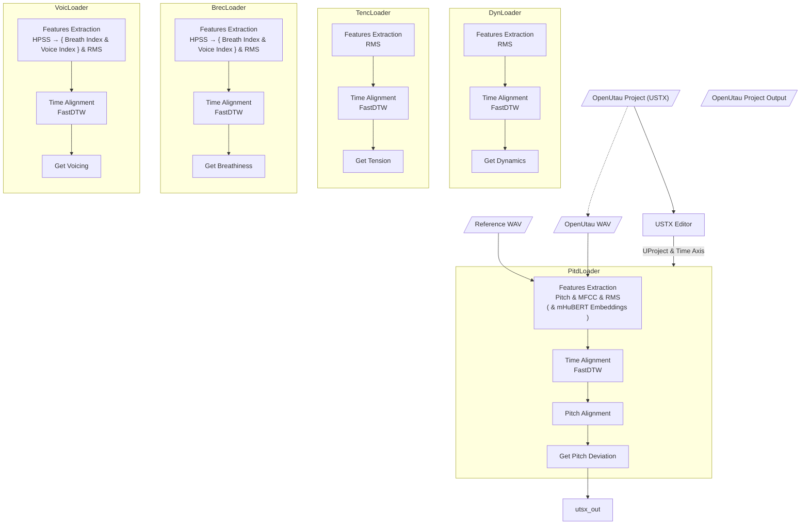

# 补充注意事项  
Ver 26.09

1. python 3.10  
ubuntu 22.04 24.04 OK

3. 必须首先安装 git-lfs

`sudo apt install git-lfs`

然后，wav音频文件 git才是正确的。  
`git clone https://github.com/NewComer00/expressive.git --depth 1`

否则  
`file reference.wav` 为 ASCII text

3. 纯 cpu运行?  
pip install -e ".[gui]"

/////////////////////

Good job!


<p align="center">
   
</p>

<p align="center">
  <a href="README.md"></a>
  <a href="README.en.md"></a>
</p>

> [!WARNING]
> 🚨 **下载前请注意** 🚨
> 
> **强烈建议您使用 `v0.9.0` 及以上版本**。早先版本的 **PITD** 表情参数处理算法存在[严重缺陷](https://github.com/NewComer00/expressive/releases/tag/v0.9.0)，会导致**音高曲线绘制错误**。下载最新版本请前往 [Releases 页面](https://github.com/NewComer00/expressive/releases)。
>
> 对于从旧版本迁移到 `v0.9.0` 及以上版本的用户，新版本中 **PITD 缩放因子（Scaler）的默认值为 `1.0`**，不再是原来的 `2.0`。若您有旧版本的配置文件，请将 **PITD 缩放因子（Scaler）设置为 `1.0`**。
>
> **🎵 感谢您使用 Expressive🎵**

# Expressive

**Expressive** 是一个为 [OpenUtau](https://github.com/stakira/OpenUtau) 开发的 [DiffSinger](https://github.com/openvpi/diffsinger) 表情参数导入工具，旨在从真实人声中提取表情参数，并导入至工程的相应轨道。

当前版本支持以下表情参数的导入：

* `Breathiness (curve)`
* `Dynamics (curve)`
* `Pitch Deviation (curve)`
* `Tension (curve)`
* `Voicing (curve)`

<div align="center">

| **工作流程** | **数据可视化** |
|:---:|:---:|
|  |  |

</div>

> - *示例来自 [`examples/明天会更好`](examples/明天会更好)，点击查看详情信息*

> [!TIP]
> <details>
>   <summary><b>👉 点击展开完整有声演示视频 👈</b></summary>
>
>   <p align="center"><video src="https://github.com/user-attachments/assets/89706eec-63f6-44f6-8ed7-1f1c73cb341e"></video></p>
>   <p align="center"><video src="https://github.com/user-attachments/assets/4076eb8b-07eb-48e6-bdec-4abeac6258c7"></video></p>
> 
> </details>

## ✅ 支持平台

* Windows / Linux
* OpenUtau Beta（或支持 DiffSinger 的其他版本）
* Python 3.10 \*

> \* 在 Windows 平台下，TensorFlow 2.10 是最后一个支持 GPU 加速的版本，Python 3.10 是它的 `.whl` 文件支持的最高 Python 版本。

### 机器学习模型

#### 音高提取

本应用默认选择 [rmvpe-onnx](https://github.com/newcomer00/rmvpe-onnx) 作为音高提取后端，仅需 CPU 即可运行。[RMVPE](https://arxiv.org/abs/2306.15412v2) 是目前公开的效果最好的音高提取算法，且推理速度较快，可以满足绝大多数使用场景。

应用也提供了 [swift-f0](https://github.com/lars76/swift-f0) 与 [CREPE](https://github.com/marl/crepe) 音高提取后端。前者仅依赖 CPU，效果一般，但速度最快。后者是业内的经典算法，速度较慢。在 CUDA 环境下，CREPE 后端会自动启用 GPU 加速。

应用还新增了一个实验性的 **hybrid** 后端。该后端融合了 rmvpe-onnx 与 swift-f0 的预测结果，以 rmvpe-onnx 的音高提取结果为主，在音频有声段中，如果 rmvpe-onnx 的置信度较低且 swift-f0 的置信度较高，则采用 swift-f0 的结果进行修正，从而提升整体音高提取的准确性。

#### mHuBERT 特征提取器

> [!IMPORTANT]
> mHuBERT 模型权重遵循 [CC-BY-NC-SA-4.0](https://creativecommons.org/licenses/by-nc-sa/4.0/) 许可证分发，**仅供非商业用途使用**。本应用只提供 mHuBERT 模型权重的下载方式，不分发模型权重。您下载并使用 mHuBERT 模型权重时，请务必遵守其许可证的规定。

本应用引入了 [mHuBERT](https://huggingface.co/utter-project/mHuBERT-147) 作为高级语音特征提取后端，用于分析不同语言发音的音素相似度。

如果您创作的歌曲与参考歌手人声的歌词大体相似，但乐曲编排（如曲速、局部歌词的切分方式等）不同，那么启用 mHuBERT 后端会提升表情参数的对齐效果。

mHuBERT 在 CPU 与 CUDA 环境下均运行良好。

## 📌 使用场景

### 需求

在使用 DiffSinger 虚拟歌手翻唱时，已经完成了填好词的无参 OpenUtau 工程，但尚未添加表情参数。本应用可以从参考人声音频中提取表情参数，并导入至 OpenUtau 工程中。

### 输入

* **歌姬音声**：由 OpenUtau 输出的无表情虚拟歌声音频（WAV 格式）。建议分段与曲速尽量与**参考人声**相近，若相差过大可能影响对齐效果，此时可考虑启用 [mHuBERT 特征提取器](#mhubert-特征提取器)。
* **参考人声**：原始人声录音（WAV 格式），可使用 [UVR](https://github.com/Anjok07/ultimatevocalremovergui) 、[MSST](https://github.com/SUC-DriverOld/MSST-WebUI) 等工具去除伴奏、和声与混响。
* **输入工程**：原始 OpenUtau 工程文件（USTX 格式）。本应用支持带有**多分段**与**多曲速**的 OpenUtau 人声音轨。
* **输出路径**：处理完成后新工程文件的保存位置。
* **音轨编号**：OpenUtau 工程中**歌姬音声**所在的音轨编号（从 1 开始）。表情参数会被导入到该音轨中。

### 输出

一个携带表情参数的新 USTX 文件。原始工程不会被修改。

> [!TIP]
> 如果您不希望额外生成新的工程文件，可以**将输出路径设置为与输入工程路径一致**。这样，表情参数会直接写入原始工程文件中。
>
> 正常情况下，程序只会更新您所选音轨中的指定表情参数，不会影响其它参数，也不会修改其他音轨。
>
> ⚠️ **如果您需要使用此功能，请提前做好备份，以防程序出错**。

## ✨ 功能特性

* [x] Windows 支持
* [x] Linux 支持
* [x] NVIDIA GPU 加速
* [x] 参数配置导入 / 导出
* [x] 表情曲线可视化
* [x] `Pitch Deviation` 参数生成
* [x] `Dynamics` 参数生成
* [x] `Tension` 参数生成
* [x] `Breathiness` 参数生成
* [x] `Voicing` 参数生成

## 🚀 直接安装

您可以直接在 [Releases](https://github.com/NewComer00/expressive/releases) 页面下载预编译的可执行文件:

### `Expressive-<version>-Windows-x64-CPU.exe`

适用于 x64 架构 Windows 的 Expressive CLI / GUI / Viewer 安装包。

仅可使用 CPU，无 CUDA 运行时库。安装体积小，但选择 CREPE 后端提取音高时速度较慢。

### `Expressive-<version>-Windows-x64-GPU.exe`

带 GPU 支持的适用于 x64 架构 Windows 的 Expressive CLI / GUI / Viewer 安装包。

含 CUDA 运行时库。在配备 NVIDIA 显卡（驱动版本 >= 450）的电脑上使用时，会大幅提高 CREPE 后端的推理速度。mHuBERT 特征提取器也可享受 GPU 加速。

## 👨‍💻 源码安装

### 克隆仓库

> [!IMPORTANT]
> 本项目使用 [Git LFS](https://git-lfs.com/) 存储 `examples/` 下的示例音频等大文件。克隆仓库前，请确保本地已正确安装 Git LFS。

```bash
git clone https://github.com/NewComer00/expressive.git --depth 1
cd expressive
```

### 安装应用

请在虚拟环境中安装本软件包及其依赖：

```bash
pip install -e ".[gpu,gui]"
```

> [!TIP]
> - `-e` 参数以可编辑模式安装，便于二次开发
> - 本软件包支持的可选依赖项包括：
>   - `gpu`：启用 GPU 加速相关依赖（如 CUDA 运行时库）
>   - `gui`：启用图形用户界面相关依赖（如 NiceGUI）
>   - `dev`：开发环境依赖（如测试框架 pytest）
>   - `all`：安装上述所有依赖项

安装完成后，您将能够使用 `expressive` 和 `expressive-gui` 两个入口点来运行**命令行界面**和**图形用户界面**。

此外，您还可以通过 `expressive-viewer` 命令启动一个独立的表情曲线可视化工具，来实时查看和分析 `expressive` 与 `expressive-gui` 提取出的表情曲线。

## 📖 使用方式

> [!TIP]
> 本节介绍的所有 Expressive 命令（以及您通过安装包安装的可执行文件）均会自动适配您的系统语言。如果您需要不同语言的界面，可以设置[环境变量 `LANGUAGE` 或 `LANG`](https://www.gnu.org/software/gettext/manual/html_node/The-LANGUAGE-variable.html) 来覆盖默认语言。
> 
> 例如，在 Windows PowerShell 中：
> ```powershell
> $env:LANGUAGE = "en_US"
> expressive-gui
> ```
> 
> 在 Linux Shell 中：
> ```bash
> LANGUAGE="en_US" expressive-gui
> ```

### 获取模型权重

> [!TIP]
> 如果您无法直接访问 Hugging Face，可通过镜像站点来获取模型文件。
> 
> 以 [https://hf-mirror.com/](https://hf-mirror.com/) 镜像站点为例，在 Windows PowerShell 中：
> ```powershell
> $env:HF_ENDPOINT = "https://hf-mirror.com"
> rmvpe-onnx download
> ```
> 
> 在 Linux Shell 中：
> ```bash
> HF_ENDPOINT="https://hf-mirror.com" rmvpe-onnx download
> ```
>
> - `HF_ENDPOINT` 环境变量会覆盖 Hugging Face 的默认 API 端点，使得模型文件从指定的镜像站点下载。
> - `rmvpe-onnx download` 可以替换为任何需要从 Hugging Face 下载模型文件的命令，包括启动本应用的命令。

#### RMVPE

若您是通过安装包获取的本应用，安装包中已包含相关模型文件，无需额外下载。

从源码安装的用户在运行 [rmvpe-onnx](https://github.com/newcomer00/rmvpe-onnx) 后端时，应用会自动从 Hugging Face 下载模型文件 [rmvpe.onnx（Copyright (c) 2022 lj1995 — MIT License）](https://huggingface.co/lj1995/VoiceConversionWebUI/blob/main/rmvpe.onnx)。

如果您希望提前下载模型文件，可在安装完成后运行以下命令：
```bash
rmvpe-onnx download
```

#### mHuBERT

[mHuBERT 模型权重](https://huggingface.co/utter-project/mHuBERT-147)受到 [CC-BY-NC-SA-4.0](https://creativecommons.org/licenses/by-nc-sa/4.0/) 许可约束，**不伴随应用分发**。

您在使用 mHuBERT 特征提取器时，应用会自动从 Hugging Face 下载 [ONNX 格式的模型权重文件](https://huggingface.co/NewComer00/mHuBERT-147-ONNX)。权重文件会被保存在 Hugging Face 默认的当前用户缓存路径中（即 `~/.cache/huggingface/hub` 目录，程序会输出具体位置），不会存储在本应用的目录里。

您也可以使用 Hugging Face 的 [hf](https://huggingface.co/docs/huggingface_hub/guides/cli) 工具手动下载模型权重，文件将被保存在当前用户的缓存目录，无需额外设置：
```bash
hf download NewComer00/mHuBERT-147-ONNX onnx/model_bnb4.onnx onnx/model_fp16.onnx onnx/model_fp32.onnx
```

### 命令行界面（CLI）

显示帮助信息

```bash
expressive --help
```

在 Windows PowerShell 中执行示例命令

```powershell
expressive `
  --utau_wav "examples/明天会更好/utau.wav" `
  --ref_wav "examples/明天会更好/reference.wav" `
  --ustx_input "examples/明天会更好/project.ustx" `
  --ustx_output "examples/明天会更好/output.ustx" `
  --track_number 1 `
  --expression dyn `
  --expression pitd `
  --pitd.semitone_shift 0 `
  --expression tenc
```

在 Linux Shell 中执行示例命令

```bash
expressive \
  --utau_wav "examples/明天会更好/utau.wav" \
  --ref_wav "examples/明天会更好/reference.wav" \
  --ustx_input "examples/明天会更好/project.ustx" \
  --ustx_output "examples/明天会更好/output.ustx" \
  --track_number 1 \
  --expression dyn \
  --expression pitd \
  --pitd.semitone_shift 0 \
  --expression tenc
```

输出工程文件将保存在 `examples/明天会更好/output.ustx`。

### 图形用户界面（GUI）

启动图形界面

```bash
expressive-gui
```

> [!IMPORTANT]
> 由于框架限制，通过 `expressive-gui` 命令启动的图形界面目前**不支持文件拖放**功能。若需使用拖放功能，请[直接安装](#-直接安装)本应用，或以脚本方式运行 `expressive_gui.py`：
> 
> ```bash
> python expressive_gui.py
> ```

### 可视化工具（Viewer）

启动表情曲线可视化工具

```bash
expressive-viewer
```

您可以在任何时候启动这个工具。在其运行期间，`expressive` 与 `expressive-gui` 提取出的表情曲线会被实时发送到其中进行可视化展示。

您可以在 `expressive-viewer` 中查看表情曲线的细节，分析提取结果，并根据需要调整参数，重新生成表情曲线。

> [!TIP]
> 如需同时浏览多个表情曲线，您可以同时启动多个 `expressive-viewer` 实例，每个实例都会独立显示接收到的数据。

## 📂 示例工程

项目的 [`examples/` 目录](examples/)下存放有多个示例。您可以在图形用户界面中导入相应示例的 `expressive_config.json` 配置文件，将预设的参数一键填写到应用中。

若您是从安装包获取的本应用，安装完毕后示例目录的快捷方式 `Expressive Examples` 将出现在您的桌面，您也可以直接导入其中的配置文件。

## 🔬 算法流程


## ⚠️ 常见问题

### 安装后首次运行图形界面，文件拖拽功能无法正常使用

#### 问题现象
在 Windows 10 / 11 平台下，通过安装包**首次**安装本应用后（先前安装过再卸载不算），应用的文件拖拽功能无法正常使用。

#### 可能原因
[NiceGUI](https://nicegui.io/) 框架对原生应用的文件拖拽功能支持尚不完善。目前本应用的文件拖拽功能是基于底层库 [pywebview](https://pywebview.flowrl.com/) 实现的。

#### 解决方案
重新打开应用后应当可以恢复正常，且该系统今后不会再出现此问题。

#### 未来计划
NiceGUI 框架已经开始着手改进文件拖拽支持，应该在未来的版本中能够解决此问题。

---

### PITD 表情曲线整体变化过于平缓

#### 问题现象
提取出的 PITD 表情曲线过于平缓，整体上几乎没有大的起伏，参考人声中的音高变化并没有反映到表情曲线上。

#### 可能原因
1. 在早于 `v0.9.0` 的版本中，PITD 表情曲线取值与音高之间的换算有问题，会导致 PITD 表情曲线整体非常平缓。
2. PITD 表情提取器中，两个置信度阈值设置**过高**，许多音高变化没有被采信。您可以在 [`expressive-viewer`](#可视化工具viewer) 中观察到，原始的音高曲线中有很多不该出现的缺失部分。

#### 解决方案
1. 请下载安装 `v0.9.0` 及之后的版本。
2. 请先尝试使用效果最好的 rmvpe-onnx 或 hybrid 后端（默认置信度阈值）。若问题仍在，尝试降低两个置信度阈值。您可以参考 [`expressive-viewer`](#可视化工具viewer) 的音高置信度曲线来辅助调整。一般来说，**歌姬音声**比较纯净，可以先调整**参考人声**的置信度阈值。

---

### PITD 表情曲线在某些位置变化过快，出现跳跃或毛刺

#### 问题现象
PITD 表情曲线在某些位置变化过快，出现非常大的跳跃或毛刺，明显不符合人声的变化规律。

#### 可能原因
1. 在早于 `v0.9.0` 的版本中，PITD 表情曲线取值与音高之间的换算有问题。
2. 参考音频的对应时间戳附近有噪声。您可以在 [`expressive-viewer`](#可视化工具viewer) 中观察到，原始的音高曲线中有很多不该出现的尖刺。
3. PITD 表情提取器中，两个置信度阈值设置**过低**，错误的识别结果被采信。您可以在 [`expressive-viewer`](#可视化工具viewer) 中观察到，原始的音高曲线中有很多不该出现的尖刺。

#### 解决方案
1. 请下载安装 `v0.9.0` 及之后的版本。
2. 可使用 [UVR](https://github.com/Anjok07/ultimatevocalremovergui) 、[MSST](https://github.com/SUC-DriverOld/MSST-WebUI) 等工具对参考音频去噪声（denoise）。
3. 请先尝试使用效果最好的 rmvpe-onnx 或 hybrid 后端（默认置信度阈值）。若问题仍在，尝试增加两个置信度阈值。您可以参考 [`expressive-viewer`](#可视化工具viewer) 的音高置信度曲线来辅助调整。一般来说，**歌姬音声**比较纯净，可以先调整**参考人声**的置信度阈值。
